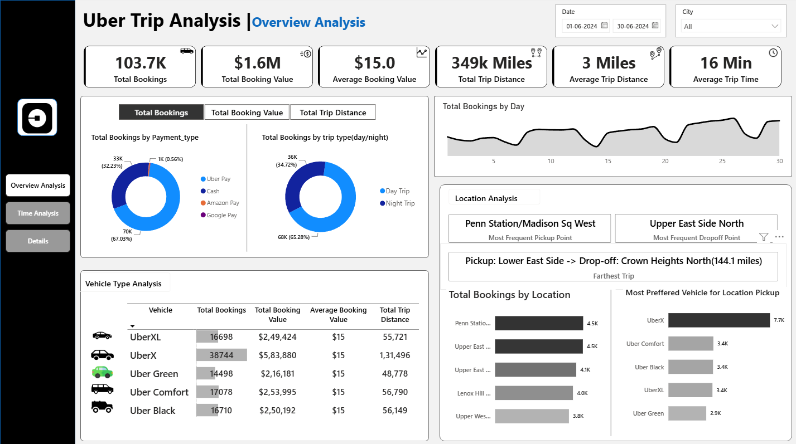

# 🚖 Uber Trip Analysis Dashboard

## 📌 Project Overview

This project presents an interactive Power BI dashboard created to analyze Uber trip data and understand booking patterns, trip performance, vehicle types, payment methods, and other key business metrics.

## 🎯 Objectives

- Analyze Uber trip and booking performance.
- Understand trends and patterns in trip data.
- Compare vehicle type performance.
- Analyze trip distance and booking values.
- Explore time-based booking patterns.

## 🛠️ Tools Used

- Power BI
- Microsoft Excel / CSV
- DAX
- GitHub

## 📊 Key Performance Indicators

- Total Bookings
- Total Booking Value
- Total Trip Distance
- Average Trip Distance
- Average Booking Value

## 🖼️ Dashboard Screenshots

### 1. Dashboard Overview

### 2. Time Analysis

## 📂 Repository Structure

- README.md – Project documentation
- Dataset – Dataset used for analysis
- Screenshots – Dashboard previews
- Power BI (.pbix) – Dashboard file

## 🔗 Live Dashboard

The interactive Power BI dashboard link will be added here.
